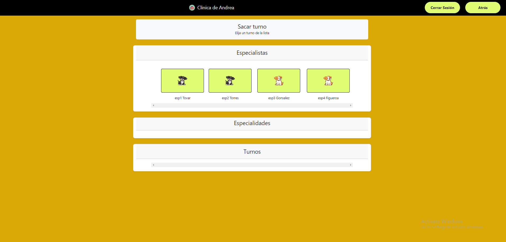
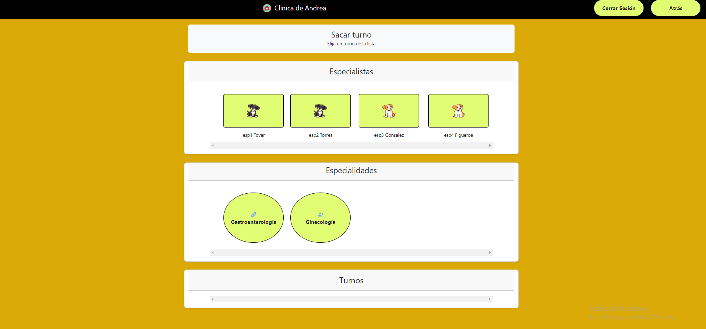
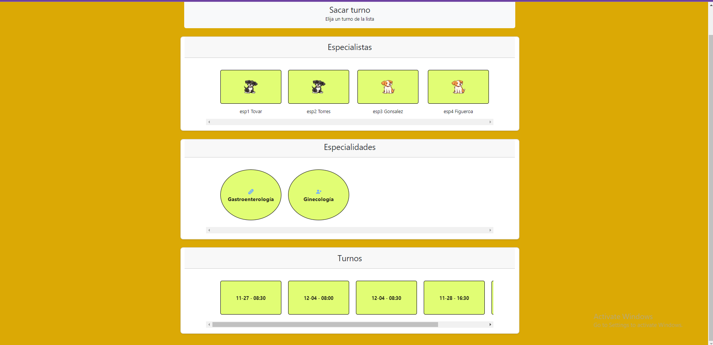

# CLINICA - Andrea Briceño - laboratorio 4

TP final de la materia Laboratorio 4 de la Tenicatura Universitaria en Programación de la UTN-FRA.

Se duede acceder como Administrador, Especialista o Paciente.

Link: https://clinica-tp-utn.web.app

La web está dividad en diferentes partes.

## Home

Pantalla de inicio.

## Login

Para loguearse.

## Registro

Para crear una cuenta de pacientes o especialistas.

registro de admin debe entrar como admin

## Mi perfil

### Paciente

Información personal y descarga de historial y turnos

### Especialista

Información personal y registro de horarios de consultas médicas

## Sacar turnos - paciente

Muestra el proceso de solicitar un turno

## Mis turnos - paciente

Muestra los turnos solicitados del paciente

## Mis turnos - especialista

Muestra los turnos asignados al especialista

## Usuarios - admin

Muestra los usuarios registrados en el sistema, se puede filtrar y descargar

